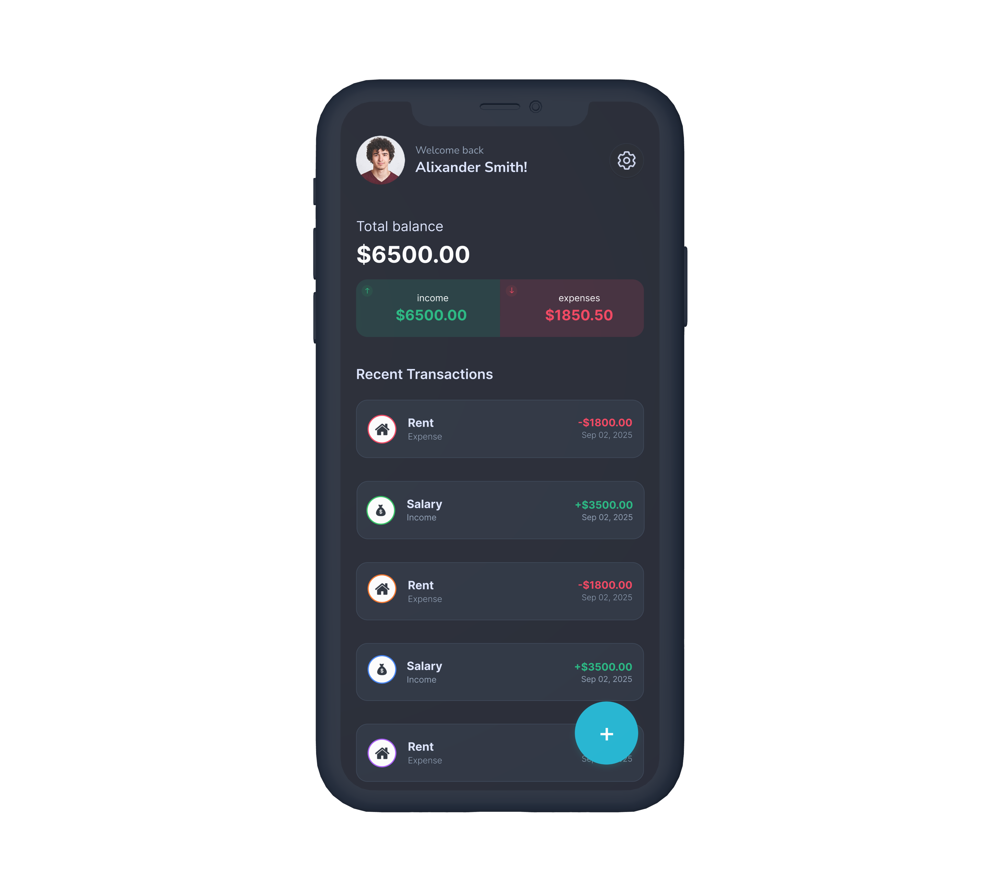

# 💳 TrueBalance

TrueBalance is a mobile app for personal finance management, helping users track their income, expenses, and overall balance efficiently with an intuitive interface.

---

## ✨ Features

- Track income and expenses easily  
- Categorize transactions for better organization  
- View overall balance and financial summaries  
- Edit or delete transactions as needed  
- Simple and intuitive user interface  

---

## 🛠 Tech Stack

- React Native & Expo  
- Context API for state management  
- Formik & Yup (forms and validation)  
- React Navigation  
- Figma for UI/UX design  

---

## 🧠 What This Project Demonstrates

- Personal finance-focused app architecture  
- Transaction tracking and summary calculation  
- Form handling and validation with Formik & Yup  
- Reusable components and scalable folder structure  
- UX/UI design implementation from concept to app  

---

📲 **Download**
- Android: Coming soon 📱  
- iOS: Coming soon 🍏

---

## 📸 Screenshots

  

  

